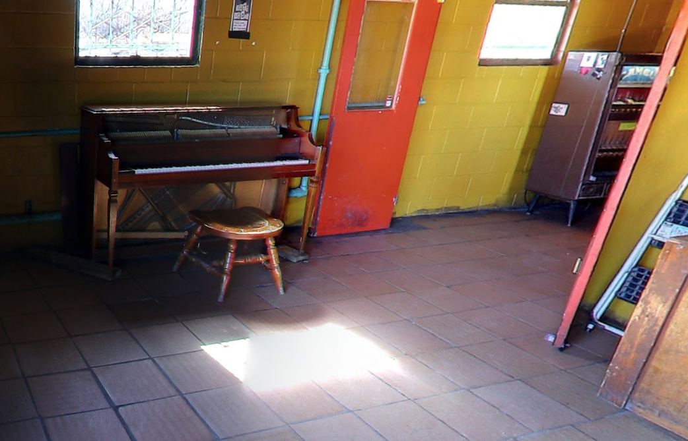

<!-- Generated by tools/gen/main.go -->

# Austin Pianos

There's ton of threads that pop up on [Reddit][], so I figured I'd capture some of the ones that I've visited and played
into a single location. Some images I pulled from the interwebs for the time being, but I plan on updating them as I get
around to playing them all. I'm sure there's more so if you know of them or have photos, don't hesitate to contribute.

[Reddit]: https://www.google.com/search?q=austin+pianos+site%3Areddit.com

## Pianos

<table>
<tr><td align="center">

</td><td valign="top">

### Austin Public Library - Windsor Park

Upright Grand. Tuned fairly well, a few notes are out but otherwise good.

</td></tr>
<tr><td align="center">

</td><td valign="top">

### Chez Zee - Balcones Dr

Baldwin Baby Grand. They do Live Music at their Sunday Brunches.

</td></tr>
<tr><td align="center">

</td><td valign="top">

### King Bee - 12th

Upright. Located next to the cigarette machine.

</td></tr>
<tr><td align="center">

</td><td valign="top">

### Juiceland - 4th and Brazos

Upright. Well tuned, small location and the music they usually play is loud.

</td></tr>
<tr><td align="center">

</td><td valign="top">

### Chick-fil-a - Braker and 183

Upright.

</td></tr>
<tr><td align="center">

</td><td valign="top">

### Fairmont Austin - Red River

I'm pretty sure this location has two pianos. There's the clear grand from Lucid, and then I saw a black baby
grand walking by there the other day. Wanted to go in to check them out but was too nervous.

Sources:
- [Lucid Pianos](https://www.lucidpianos.com/portfolio/custom-piano-fairmont-hotel-austin-tx/)

</td></tr>
<tr><td align="center">

</td><td valign="top">

### Planet K - Stassney

Upright. By the entrance to the Stassney Lane location.

</td></tr>
<tr><td align="center">

</td><td valign="top">

### Planet K - Bee Cave

Upright. Reported to be out of Tune.

</td></tr>
<tr><td align="center">

</td><td valign="top">

### Planet K - Round Rock

Upright grand.

</td></tr>
<tr><td align="center">

</td><td valign="top">

### Planet K - Cezar Chavez

Upright grand. Some sections held tune, but its missing lots of black key tops.

</td></tr>
<tr><td align="center">

</td><td valign="top">

### Planet K - Lamar

Looks like they may have an upright outside from one photo I saw online.

</td></tr>
<tr><td align="center">

</td><td valign="top">

### White Horse

Upright. By the outdoor area, just inside where the pool table is.

</td></tr>

</table>

